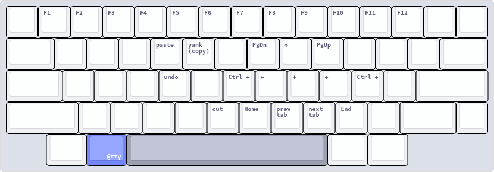

# Keyboards, Layouts, Hotkeys

## Table of Contents {TOC}

<!-- toc-start -->

- [Spec](<#Spec>)
- [Programmable Layers {kanata}](<#Programmable Layers {kanata}>)
  - [Introduction](<#Introduction>)
  - [Legend](<#Legend>)
  - [General](<#General>)
  - [Base Layer {@base}](<#Base Layer {@base}>)
  - [Navigation Layer {@navigation}](<#Navigation Layer {@navigation}>)
  - [Tmux Layer {@tmux}](<#Tmux Layer {@tmux}>)
  - [Tmux Movement Layer {@tmux-movement}](<#Tmux Movement Layer {@tmux-movement}>)
  - [TTY Layer {@tty}](<#TTY Layer {@tty}>)
  - [Transparent Layer {@transparent}](<#Transparent Layer {@transparent}>)

<!-- toc-end -->

## Spec

- Keyboard: [HHKB professional 2](https://www.hhkeyboard.com/uk/products/pro2)
- Layouts: US(dvorak), RU(йцукен)
- Programmable features: [Kanata](https://github.com/jtroo/kanata)

## Programmable Layers {kanata}

### Introduction

Since HHKB 2 is not programmable (at least with a standard controller), I use Kanata as software
solution.

Information about all configuration options can be found in
[documentation](https://github.com/jtroo/kanata/blob/main/docs/config.adoc).

This section produce configuration file in `kbd` format, that used by kanata. Result file can be
found here: [default.kbd](../modules/combined/keyboard/kanata/default.kbd)

```{.kbd file=modules/combined/keyboard/kanata/default.kbd}
<<kanata-config-body>>
```

### Legend


### General

Configuration file **must** have exactly one `defsrc` entry. This defines the order of keys that the
`deflayer` and `deflayermap` entries will operate on.

`defsrc` block doesn't _necessarily_ have to coincide with actual input keyboard. I specify a full
100% `defsrc` block, but only use 60% keyboard. This will mean that every specified `deflayer` will
also have to match 100% `defsrc`, and that actual keyboard would be physically unable to trigger
about 40% of keymaps, but it allow easily apply this configuration to any other keyboard.

> [!NOTE]
>
> My language layouts and kanata settings are kept separately. But all pictures show the actual
> result that I have in combination

```{.kbd #kanata-config-body}
(defsrc
  esc  f1   f2   f3   f4   f5   f6   f7   f8   f9   f10  f11  f12        ssrq slck pause
  grv  1    2    3    4    5    6    7    8    9    0    -    =    bspc  ins  home pgup  nlck kp/  kp*  kp-
  tab  q    w    e    r    t    y    u    i    o    p    [    ]    \     del  end  pgdn  kp7  kp8  kp9  kp+
  caps a    s    d    f    g    h    j    k    l    ;    '    ret                        kp4  kp5  kp6
  lsft z    x    c    v    b    n    m    ,    .    /    rsft                 up         kp1  kp2  kp3  kprt
  lctl lmet lalt           spc            ralt rmet cmp  rctl            left down rght  kp0  kp.
)
```

Define timeouts for `tap-hold` bindings.

```{.kbd #kanata-config-body}
(defvar
  tap-timeout 100
  hold-timeout 200
  tap-dance-timeout 200

  tt $tap-timeout
  ht $hold-timeout
  tdt $tap-dance-timeout
)
```

Define layer switch aliases

```{.kbd #kanata-config-body}
(defalias
  nav (layer-while-held navigation)
  tty (layer-while-held tty)
  tmux (layer-while-held tmux)
  tmux-movement (layer-while-held tmux-movement)
  set-base (layer-switch base)
  set-transparent (layer-switch transparent)
)
```

### Base Layer {@base}

The base layer uses home-row mods and a modified escape position.


Define aliases to easily access from `deflayer`.

```{.kbd #kanata-config-body}
(defalias
  lctl (tap-hold $tt $ht esc lctl)
  a (tap-hold-release $tt $ht a lalt)
  s (tap-hold-release $tt $ht s lmet)

  d (tap-hold-release $tt $ht d lsft)
  f (tap-hold-release $tt $ht f lctl)
  j (tap-hold-release $tt $ht j rctl)
  k (tap-hold-release $tt $ht k rsft)
  l (tap-hold-release $tt $ht l rmet)

  ; (tap-hold-release $tt $ht ; ralt)

  spc (tap-hold $tt $ht spc @nav)
  lalt @tmux

  base-to-transparent (tap-dance $tdt ( kp* (macro kp* kp*) @set-transparent))
)
```

Define base layer (should be first defined layer in configuration file)

```{.kbd #kanata-config-body}
(deflayer base
  esc  f1   f2   f3   f4   f5   f6   f7   f8   f9   f10  f11  f12        ssrq slck pause
  grv  1    2    3    4    5    6    7    8    9    0    -    =    bspc  ins  home pgup  nlck kp/  @base-to-transparent  kp-
  tab  q    w    e    r    t    y    u    i    o    p    [    ]    \     del  end  pgdn  kp7  kp8  kp9  kp+
  @lctl @a @s   @d   @f    g    h   @j   @k   @l   @;    '    ret                        kp4  kp5  kp6
  lsft z    x    c    v    b    n    m    ,    .    /    rsft                 up         kp1  kp2  kp3  kprt
  @lctl lmet @lalt           @spc            ralt rmet cmp  rctl            left down rght  kp0  kp.
)
```

### Navigation Layer {@navigation}



```{.kbd #kanata-config-body}
(deflayermap (navigation)
  lalt @tty

  m C-S-tab ;; previous tab
  , C-tab ;; next tab

  r C-. ;; paste
  t C-i ;; yank/copy
  f C-/ ;; undo
  b C-b ;; cut

  u pgdn
  o pgup

  i up
  j left
  k down
  l rght

  h C-left
  ; C-rght

  n home
  . end

  1 f1
  2 f2
  3 f3
  4 f4
  5 f5
  6 f6
  7 f7
  8 f8
  9 f9
  0 f10
  - f11
  = f12
)
```

### Tmux Layer {@tmux}


```{.kbd #kanata-config-body}
(defvar
  tmux-leader C-spc
)

(deflayermap (tmux)
  spc @tty
  lsft @tmux-movement

  n (macro $tmux-leader i) ;; create new window
  m (macro $tmux-leader C-r) ;; focus previous window
  , (macro $tmux-leader C-l) ;; focus next window

  u (macro $tmux-leader S-q) ;; split pane vertical
  o (macro $tmux-leader S-5) ;; split pane horizontal

  h (macro $tmux-leader h) ;; detach from session

  i C-v ;; tmux-vim-navigation up
  j C-j ;; tmux-vim-navigation left
  k C-c ;; tmux-vim-navigation down
  l C-p ;; tmux-vim-navigation right

  b (macro $tmux-leader b) ;; kill pane
  / (macro $tmux-leader /) ;; zoom pane
)
```

### Tmux Movement Layer {@tmux-movement}


```{.kbd #kanata-config-body}
(deflayermap (tmux-movement)
  j (macro $tmux-leader S--) ;; move pane left
  l (macro $tmux-leader S-=) ;; move pane right

  m (macro $tmux-leader C-S-r) ;; move window left
  , (macro $tmux-leader C-S-l) ;; move window right
)
```

### TTY Layer {@tty}

Used to quickly switch between linux tty's.


```{.kbd #kanata-config-body}
(deflayermap (tty)
  1 C-A-f1
  2 C-A-f2
  3 C-A-f3
  4 C-A-f4
  5 C-A-f5
  6 C-A-f6
  7 C-A-f7
)
```

### Transparent Layer {@transparent}

Used to temporary disable almost all layers

```{.kbd #kanata-config-body}

(defalias
  transparent-to-base (tap-dance $tdt ( kp* (macro kp* kp*) @set-base))
)

(deflayer transparent
  esc  f1   f2   f3   f4   f5   f6   f7   f8   f9   f10  f11  f12        ssrq slck pause
  grv  1    2    3    4    5    6    7    8    9    0    -    =    bspc  ins  home pgup  nlck kp/  @transparent-to-base  kp-
  tab  q    w    e    r    t    y    u    i    o    p    [    ]    \     del  end  pgdn  kp7  kp8  kp9  kp+
  lctl a    s    d    f    g    h    j    k    l   ;    '    ret                         kp4  kp5  kp6
  lsft z    x    c    v    b    n    m    ,    .    /    rsft                 up         kp1  kp2  kp3  kprt
  lctl lmet @lalt           @spc            ralt rmet cmp  rctl            left down rght  kp0  kp.
)
```
