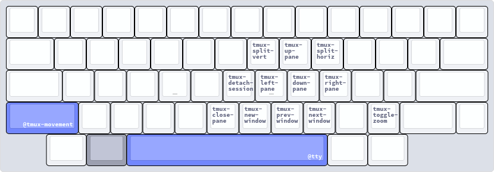

# Keyboards, Layouts, Hotkeys

## Table of Contents {TOC}

<!-- toc-start -->

- [Spec](#Spec)
- [Programmable Layers {Kanata}](<#Programmable Layers {Kanata}>)
  - [Legend](#Legend)
  - [Base Layer {@base}](<#Base Layer {@base}>)
  - [Navigation Layer {@navigation}](<#Navigation Layer {@navigation}>)
  - [Tmux Layer {@tmux}](<#Tmux Layer {@tmux}>)
  - [Tmux Movement Layer {@tmux-movement}](<#Tmux Movement Layer {@tmux-movement}>)
  - [TTY Layer {@tty}](<#TTY Layer {@tty}>)

<!-- toc-end -->

## Spec

- Keyboard: [HHKB professional 2](https://www.hhkeyboard.com/uk/products/pro2)
- Layouts: US(dvorak), RU(йцукен)
- Programmable features: [Kanata](https://github.com/jtroo/kanata)

## Programmable Layers {Kanata}

Since HHKB 2 is not programmable (at least with a standard controller), I use Kanata as software
solution.

> [!keyboard Layouts & Kanata Layers]
>
> My language layouts and kanata settings are kept separately. But all pictures show the actual
> result that I have in combination

### Legend

### Base Layer {@base}

The base layer uses home-row mods and a modified escape position.

### Navigation Layer {@navigation}

### Tmux Layer {@tmux}

### Tmux Movement Layer {@tmux-movement}

### TTY Layer {@tty}

Used to quickly switch between linux tty's.

`tty*` is `C-A-F*`, for example `tty1` is `C-A-F1`

